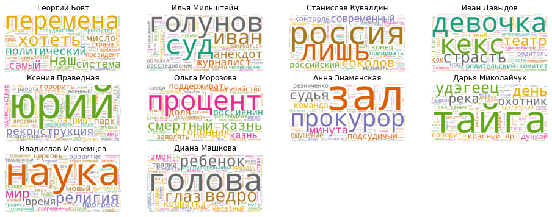
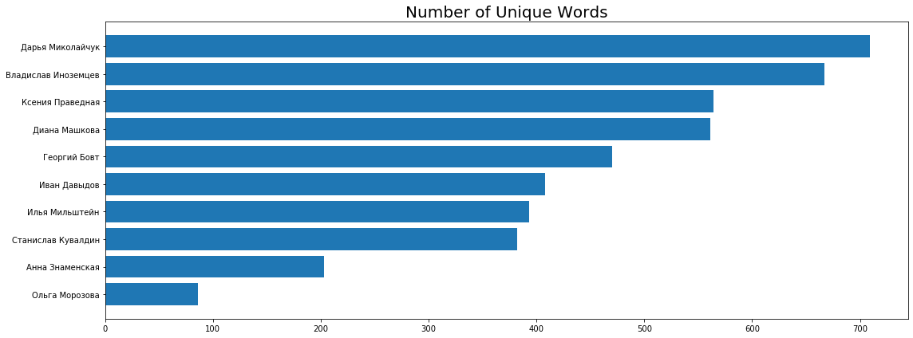

Natural Language Processing in Python 
===========

NLP analysis of texts for different authors from [snob.ru](https://snob.ru)

Our goal is to look at transcripts of various authors and note their similarities and differences.

## Look at the most common top words --> add them to the stop word list
### Let's first pull out the top 30 words for each author

    Bowt
    перемена, хотеть, это, дело, система, самый, наш, политический, число, общество, мочь, понимать, человек, государство
    ---
    Mlshtn
    голунов, суд, дело, иван, который, расследование, журналист, анекдот, весь, это, свой, конец, заниматься, обложка
    ---
    Kuval
    это, россия, соколов, современный, российский, лишь, контроль, конец, свой, человек, преподаватель, иметь, вызывать, историк
    ---
    Dvdv
    это, весь, человек, который, история, кекс, девочка, страсть, комитет, театр, родительский, государственный, стол, правильный
    ---
    Prav
    юрий, реконструкция, парк, патриот, человек, это, весь, говорить, деревня, удовольствие, год, красноармеец, который, мир
    ---
    Mrz
    процент, казнь, смертный, сторонник, поддерживать, убийство, россиянин, доля, заявлять, среди, число, мнение, выступать, опрашивать
    ---
    Znam
    зал, прокурор, весь, это, судья, заключение, резниченко, подсудимый, ощущение, команда, дверь, обвинительный, минута, распахиваться
    ---
    Mikol
    тайга, год, удэгеец, который, день, становиться, река, яр, красный, это, охотник, дункай, говорить, миранский
    ---
    Inoz
    наука, общество, человек, который, религия, становиться, мир, это, время, весь, свой, прогресс, новый, научный
    ---
    Mashk
    голова, ведро, глаз, ребенок, становиться, кроватка, змея, железный, тряпка, словно, воспитательница, кровать, тело, съедать
    ---

## Let's make some word clouds!

## Plot unique word counts

